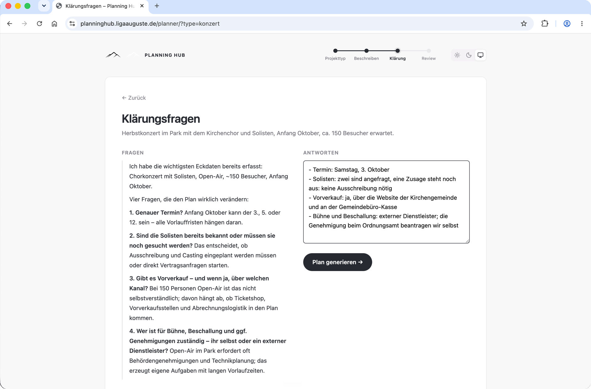
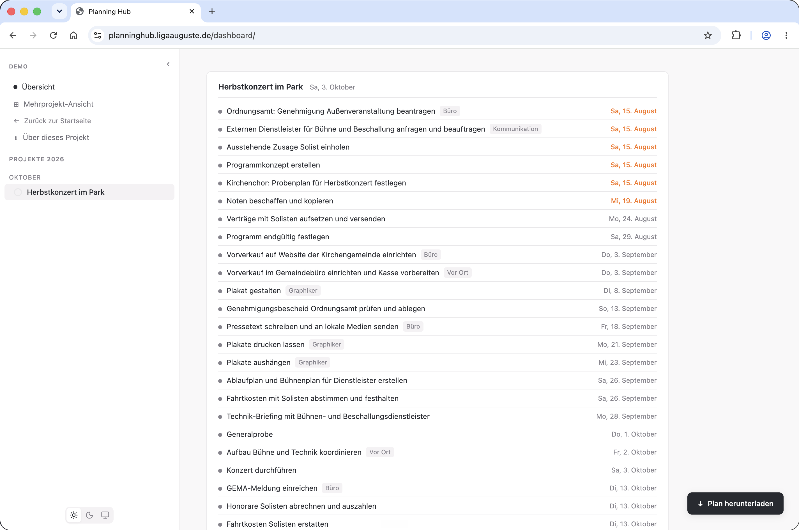
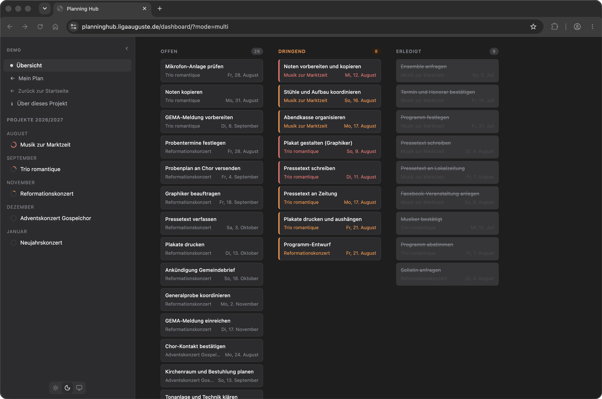

# Planning Hub

An AI-powered project planning assistant. Describe an event or project in plain language, get clarifying questions from Claude, review and edit a generated task plan with realistic deadlines — then write it directly to Notion and track everything on a live dashboard with AI-generated weekly summaries.

> **Live demo:** [planninghub.ligaauguste.de](https://planninghub.ligaauguste.de) — no login required
>
> The interface and all AI-generated output are in German; the codebase and its documentation are in English. See [`CLAUDE.md`](CLAUDE.md) for the full convention.
>
> Built by specifying and reviewing rather than typing: see [How this was built](#how-this-was-built).

---

## Screenshots

Captions are English; the screenshots themselves stay German, per the convention above. All taken in demo mode, so no real Notion data appears here.

**The planner asks clarifying questions before generating a plan** — shaped by the actual project description, not a fixed form:



**Generated plan** — an editable, dated task list, ready to save or write to Notion:



**Dashboard** — multi-project Kanban board, dark mode:



---

## The problem it solves

Running multiple parallel projects means repeating the same planning process each time: coordinating people, booking services, managing communication, hitting deadlines. Each project type has its own rules and timelines.

The existing setup was a Notion view filtered by "this week" — useful, but it required knowing what to look for. Nothing surfaced what was actually urgent, what was missing, or how a new event compared to past ones.

---

## How it works

**Event planner** — Four-step flow:
1. Choose project type (concert, wedding, recruiting, custom…)
2. Describe the project in free text ("Outdoor concert, ~200 attendees, ticketed, external musicians")
3. Claude asks up to 4 clarifying questions — only what actually changes the task list
4. Review an editable task table with pre-filled dates, then save or write to Notion

**Dashboard** — Claude reads all active projects and open tasks, then generates a prioritised summary in plain language. Not a list of raw data, but an actual status read: what's urgent, what's on track, what needs attention today.

**Time-lapse simulation** — In demo mode, jump to any point in the project timeline and see how the dashboard would look: which tasks would be done, what the AI summary says, what's urgent. Claude picks 4 narrative moments (e.g. "6 weeks out", "dress rehearsal", "day after") per project.

**When Claude or Notion is down** — The dashboard serves the last known-good data with a notice (or an empty state if the cache is cold); if only the AI call fails, project data stays visible and just the summary is missing. Planner errors re-render the same step with a German message and the input preserved — retrying is safe: an existing project is found rather than duplicated, and already-written tasks are skipped. Failed task updates return a non-200 response and a brief red flash; the page only changes state once Notion has confirmed the write.

---

## Architecture decisions

### RAG without a vector database

Historical events — several dozen completed projects since 2021 (the demo fixture ships a three-event sample) — are loaded directly into Claude's context as structured text, cached for 24 hours. No embeddings, no vector index. At this data volume, the full history fits in a single context window — simpler code, no infrastructure overhead, and Claude can reason across all past events at once rather than just the top-k nearest neighbours.

### Synchronous AI calls

Every Claude call runs inside the request — no task queue, no background workers. The Sonnet call blocks a gunicorn worker for its duration, and that is a deliberate choice: there is one user, the demo is nginx-rate-limited to 30 requests per minute (burst 10), and gunicorn runs two workers with a 120-second timeout. A task queue would add a broker, a worker process and a result store to solve a concurrency problem that does not exist. The trigger for revisiting: more than one user planning concurrently, i.e. requests regularly occupying both workers. While a call runs, the UI shows a loading state and blocks double submits.

The one place where that blocking was worth removing is the multi-project demo view — where the landing-page CTA sends every first-time visitor. Its input is a pure function of `date.today()` with no per-visitor data, so its summary is cached for the day instead of being generated per request. The cache (`DatabaseCache`, shared across both gunicorn workers) makes that one call per day, not one per worker.

### Structured logging over a hosted tracker

Every Claude call goes through one wrapper (`log_claude_call` in `ai.py`) that already existed to translate SDK failures into the app's own `AIUnavailableError`; it now also times the call and logs the model, duration and token usage on success — or just the outcome on failure — as one plain key=value line (`claude_call call=... model=... duration_ms=... input_tokens=... output_tokens=... outcome=...`) via a dedicated `projects` logger. A `StreamHandler` writes it to the console: the Dockerfile already runs with `PYTHONUNBUFFERED=1`, and `docker compose logs` is what's reachable in this deployment, since neither compose file mounts a log volume. No Sentry or other hosted tracker — this is a project with one user, and the same questions (how long a call took, what it cost, whether it succeeded) are answered by grepping `docker compose logs` for `claude_call`, without a second account or dependency.

### Domain rules in the prompt, not in code

Every domain has planning rules that Claude doesn't know by default — legal requirements, vendor workflows, internal conventions. These are encoded explicitly in the prompt as editable rules rather than as conditional logic, so planning heuristics stay readable, adjustable, and separate from application code.

Where a rule lives depends on who owns it. In production it is a `PlannerRule` row the maintainer curates for everyone. In demo mode the public page has no authentication, so a shared table would let any visitor rewrite the rules every other visitor's plan is generated with — there the rules live in the visitor's own session instead, starting empty rather than seeded from the maintainer's concert-specific defaults, so a visitor's example plan is built from their own rules. Both sit behind one interface in `rules.py`, so the views never learn which backend answered. Each rule can also be scoped to one or more project types (concert-only rules don't leak into a wedding plan); a rule with no type selected applies to all of them.

### Summary references by index, resolved live

The AI weekly summary names real tasks, and those need to resolve to real task IDs for their inline checkboxes. Claude does not echo Notion page IDs back: an LLM copies a long opaque UUID less reliably than a small integer, and `strict: true` tool use would only guarantee the JSON's *structure*, not that a copied ID is the right one. Instead the prompt numbers every project and task, Claude answers with indices (`project_ref`, `task_refs`), and the server resolves them against its own data — an out-of-range index is dropped rather than rendered as a broken checkbox. Every task occupies a number, done ones included, so toggling a task cannot shift the numbering under a cached summary's references.

The same layering fixes staleness: every cache (8h production cache, daily demo cache, session-stored time-lapse summaries) stores Claude's **raw, unresolved** reference dict, and references are resolved against live data at render time. Done-state is therefore always current — a checkbox toggled seconds ago renders correctly even though the summary around it is hours old.

### Notion as source of truth

Notion already holds years of project history and is the daily working environment, so the app reads and writes Notion directly instead of migrating the data — the plan gets edited in the tool that is already in daily use. The cost: every dashboard render is a network call. Hence the 8-hour cache, plus a never-expiring last-known-good copy that is served with a notice when Notion is down. The rejected alternative — mirroring project data into Django models — was in the codebase once: four unused models were deleted because nothing ever read them. The local database now holds only `PlannerRule` (the production planning rules) and `DemoEvent` (anonymous usage telemetry).

### Context as Claude's own suggestion, not a keyword guess

Each production task belongs to a workflow context (e.g. planning, admin, on-site) — one of a fixed vocabulary Claude already suggests per task while generating the plan. The planner review screen offers it as an editable dropdown, and the confirmed value is persisted to Notion's `Kontext` property alongside the task. The AI weekly-summary prompt then groups open tasks by context across all active projects. An earlier version derived context after the fact from task-name keywords instead — that broke down the moment two maintainers' vocabularies disagreed, and produced no useful grouping for a demo visitor's one-off project, so context is a production-only concept: demo mode does not collect, derive, store or display it.

---

## How this was built

The implementation is delegated to Claude Code. What stays with me is the specification and the review.

Every change runs on its own branch and lands through a pull request; nothing goes to `main` directly. Three things make that delegation pay off:

- **`CLAUDE.md`** carries the conventions an agent has to follow, including the deliberate exceptions it must not "fix". Without it the same misunderstandings come back every session.
- **`docs/`** holds a written record for each larger change: the context that made it necessary, the decision taken, and how it was verified. Each one names the issue it implements.
- **The test suite** is where the delegation is actually checked: 5,998 lines of tests against 3,188 lines of application code, run in CI on every pull request against both SQLite and Postgres, because both configurations ship.

A worked example, start to finish: [Issue #116](https://github.com/liga-auguste/planning-hub/issues/116) → [`docs/planner-step-navigation.md`](docs/planner-step-navigation.md) → [PR #123](https://github.com/liga-auguste/planning-hub/pull/123).

---

## Features

- **AI weekly summary** — Claude returns structured JSON referencing projects and tasks by index; the summary renders with real inline task checkboxes (toggling the same task API as the Kanban board) and project links resolved server-side
- **Event planner** — free-text → clarifying questions → editable task table → Notion write, with loading states and double-submit protection on every AI step
- **Time-lapse simulation** — jump to any point in the project timeline, see AI summary for that moment. In demo mode it applies to the visitor's own session plan only — the example projects carry none of its moments and stay on the real date
- **Kanban view** — Open / Urgent / Done columns with progress bar; the grouping is unchanged, and only overdue cards carry a red accent
- **Task management** — check tasks done, reschedule due dates, "→ today" shortcut for overdue tasks. In demo mode rescheduling covers the visitor's own session plan only — the example projects live in no session, so it is not offered for them
- **Urgency system** — overdue / due today / urgent / on track per task and project; the sidebar progress ring turns red only when something is overdue and stays neutral otherwise; open tasks without a date stay neutral instead of counting as done
- **Plan download** — export session plan as Markdown with AI-tool tips
- **Usage stats** — anonymous event tracking (plans generated / downloaded, by project type)
- **Editable planning rules** — drag-and-drop admin UI, toggle on/off, no code change needed. In demo mode each visitor edits their own session copy, so the public page cannot be rewritten for everyone else
- **8h caching with stale fallback** — Notion API responses cached in a shared database backend; a never-expiring last-known-good copy keeps the dashboard usable during outages; manual refresh button. In demo mode the multi-project summary is cached for the day, and the session plan's summaries per simulated moment
- **DEMO_MODE** — runs on fixture data, no Notion credentials needed. Navigation between the visitor's own plan and the example projects is documented in [`docs/demo-mode.md`](docs/demo-mode.md)

---

## Tech stack

| Layer | Technology |
|---|---|
| Backend | Django 6.0, Python 3.12 |
| Database | PostgreSQL 16 (prod) · SQLite (demo) |
| AI | Claude API — `claude-sonnet-4-6` (planner + summaries) · `claude-haiku-4-5` (time-lapse) |
| Data source | Notion API (notion-client 2.2.1) |
| Frontend | Bootstrap 5.3 (local, CSS only), Lucide icons (ISC), vanilla JS |
| Web server | Nginx + Gunicorn |
| Deployment | Docker Compose, Hetzner VPS |

---

## Setup

### Local development

```bash
git clone https://github.com/liga-auguste/planning-hub
cd planning-hub
python -m venv .venv
source .venv/bin/activate
pip install -r requirements.txt
```

Create `.env`:

```
ANTHROPIC_API_KEY=your_key
DEMO_MODE=true
SECRET_KEY=any-local-secret
DEBUG=true
```

A missing `ANTHROPIC_API_KEY` (or `NOTION_API_KEY` outside `DEMO_MODE`) fails
immediately with a clear message when the server starts, not on the first
request.

Run:

```bash
python manage.py migrate
python manage.py runserver
```

Open [http://127.0.0.1:8000](http://127.0.0.1:8000)

### Tests

```bash
python manage.py test projects
```

The Claude API is stubbed in `DemoModeTestCase`, so the suite makes no network calls and needs no API key:

```bash
env -u ANTHROPIC_API_KEY python manage.py test projects
```

`.github/workflows/test.yml` runs the suite on every pull request and on every push to `main`, on Python 3.12 to match the `Dockerfile`. It runs twice, once per database backend: `DEMO_MODE=true` for SQLite, which is what the demo deployment runs, and `DEMO_MODE=false` against a `postgres:16` service container, which is what production runs. Neither leg needs an API key. Covering both means a migration that only applies on SQLite cannot reach production, where `entrypoint.sh` runs `migrate` on every container start.

### Linting

`.github/workflows/ruff.yml` gates the same events on `ruff check` and `ruff format --check`. The rule set is Ruff's default minus two families, each carrying its reason in `pyproject.toml`. Ruff is pinned to one version in both the workflow and `requirements-dev.txt`, so a new release cannot fail a pull request that changed nothing; it is deliberately absent from `requirements.txt`, which the `Dockerfile` installs — a linter has no business in the production image.

```bash
pip install -r requirements-dev.txt
ruff check .
ruff format --check .
```

Neither command above writes, so in that order — and in CI, which runs the same two — the sequence does not matter. It starts to matter the moment you format in place: a `# noqa` binds to its physical line, and `ruff format .` can split the line it sits on, leaving the suppression on the closing bracket while the finding stays on the first line. A `ruff check .` from before that pass would have called the file clean. So when the formatter writes, run it first and check afterwards.

### With Notion (full mode)

Add to `.env`:

```
NOTION_API_KEY=your_notion_key
DEMO_MODE=false
DB_HOST=localhost
DB_PASSWORD=your_db_password
```

In `projects/notion.py`, replace the two database IDs with your own:

```python
PROJECTS_DB = "your-projects-database-id"
TASKS_DB = "your-tasks-database-id"
```

The German Notion property names (`"Name der Veranstaltung"`, `"Wann?"`, `"Status/Aufgaben"`, `"Related to Projekte"`) are hardcoded in `notion.py` and must exist in your databases as well.

```bash
createdb planning_hub
python manage.py migrate
python manage.py seed_rules
python manage.py runserver
```

### Docker (demo)

```bash
cp .env.example .env  # fill in ANTHROPIC_API_KEY + SECRET_KEY
docker compose -f docker-compose.demo.yml up --build -d
```

### Docker (production)

```bash
cp .env.example .env  # fill in all keys including NOTION_API_KEY + DB_PASSWORD
docker compose up --build -d
```

---

## Project structure

```
projects/
  ai.py              # Claude API calls: weekly summary, time-lapse moments, context derivation
  planner.py         # RAG-based plan generation (questions + tasks)
  notion.py          # Notion API read/write
  demo_data.py       # Fixture data for DEMO_MODE
  rules.py           # Planning rules: database in production, session in demo mode
  views.py           # Dashboard, task toggle, time-lapse, stats
  planner_views.py   # 4-step planner flow
  models.py          # PlannerRule, DemoEvent
  startup.py         # Fail-fast API-key checks at server start
  tests.py           # Test suite, fully offline (Claude stubbed)
  urls.py            # Dashboard, task actions, legal pages
  planner_urls.py    # Planner flow + planning-rules routes
  templates/projects/           # 15 templates, all JS inline
  management/commands/seed_rules.py  # Seed initial planner rules
docs/
  template-refactoring.md      # Base-template inheritance layout, as carried out
  demo-mode.md                  # Demo-mode navigation states, sidebar links, banner
  planner-step-navigation.md    # One-step-back stepper links, session-backed draft state
  screenshots/                  # README images
```

---

## License

MIT — built by [Liga Auguste](https://ligaauguste.de)

The planner's tile icons are from [Lucide](https://lucide.dev), used under the ISC License, Copyright (c) Lucide Contributors.
